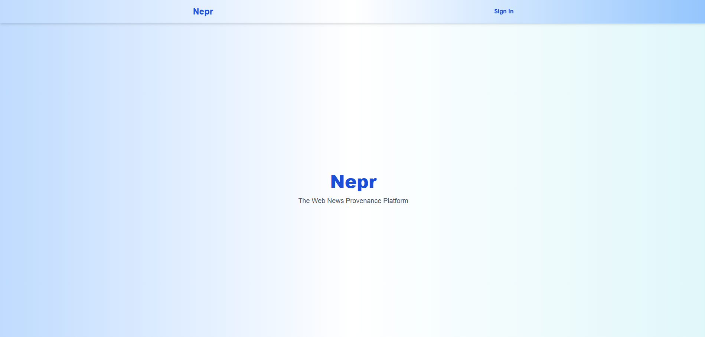
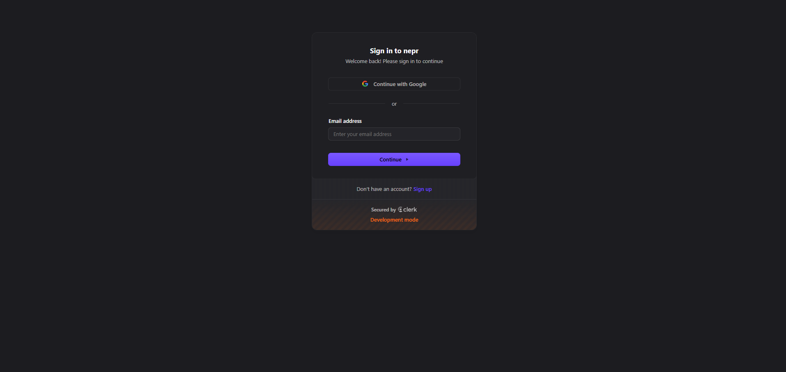
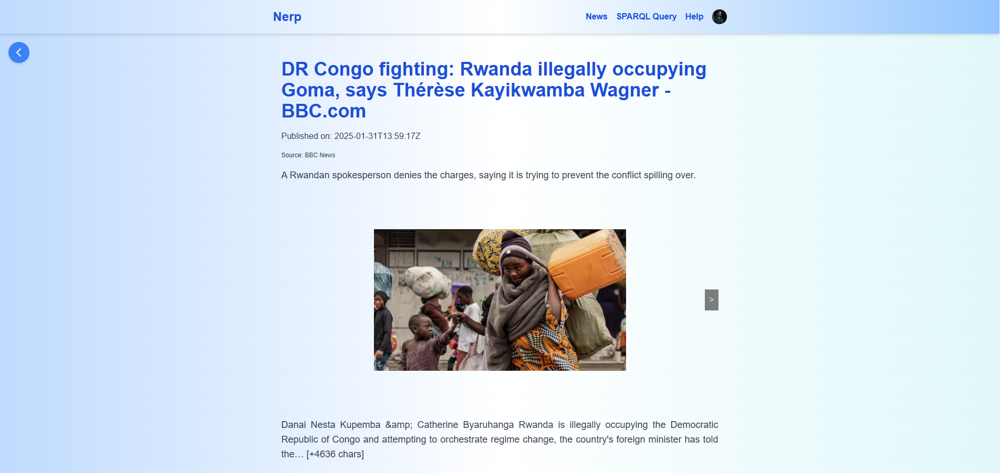
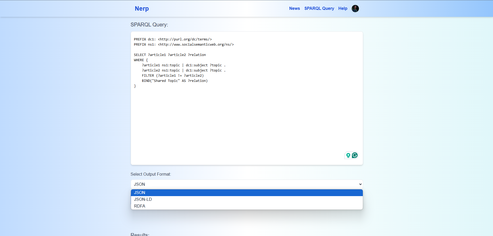

<div align="center">

  <h1>Web News Provenance</h1>
  
  <p>
    The platform where you can get your news 
  </p>
  
  
<!-- Badges -->
<p>
  <a href="https://github.com/SavRares/Web-News-Provenance/graphs/contributors">
    
  </a>
  <a href="">
    
  </a>
  <a href="https://github.com/SavRares/Web-News-Provenance/network/members">
    
  </a>
  <a href="https://github.com/SavRares/Web-News-Provenance/stargazers">
    
  </a>
  <a href="https://github.com/SavRares/Web-News-Provenance/issues/">
    
  </a>
  <a href="https://github.com/SavRares/Web-News-Provenance/blob/master/LICENSE">
    
  </a>
</p>
   
<h4>
    <a href="https://github.com/SavRares/Web-News-Provenance/">View Demo</a>
  <span> · </span>
    <a href="https://github.com/SavRares/Web-News-Provenance">Documentation</a>
  <span> · </span>
    <a href="https://github.com/SavRares/Web-News-Provenance/issues/">Report Bug</a>
  <span> · </span>
    <a href="https://github.com/SavRares/Web-News-Provenance/issues/">Request Feature</a>
  </h4>
</div>

<br />

<!-- Table of Contents -->

# :notebook_with_decorative_cover: Table of Contents

- [About the Project](#star2-about-the-project)
  - [Screenshots](#camera-screenshots)
  - [Tech Stack](#space_invader-tech-stack)
  - [Features](#dart-features)
  - [Color Reference](#art-color-reference)
  - [Environment Variables](#key-environment-variables)
- [Getting Started](#toolbox-getting-started)
  - [Prerequisites](#bangbang-prerequisites)
  - [Run Locally](#running-run-locally)
  - [Deployment](#triangular_flag_on_post-deployment)
- [Roadmap](#compass-roadmap)
- [Contributing](#wave-contributing)
- [License](#warning-license)
- [Contact](#handshake-contact)

<!-- About the Project -->

## :star2: About the Project

<!-- Screenshots -->

### :camera: Screenshots

<div align="center"> 
  <p>Once you entered our platform a landing page will be loaded, where one can login/create an account.</p>
  
  <p> When signing in the user will be redirected to another page to Sign-In trough our Identity provider, Clerk.</p>
  
  <p>Once authenticated the user will be able to scroll trough multiple news available on our platform, and of course read their details by clicking on the cards.</p>
  
  
  <p>Another page available for users is the "SPARQL Query" page where users can write SPARQL queries and receive answers in different formats</p>
  
</div>

<!-- TechStack -->

### :space_invader: Tech Stack

<details>
  <summary>Client</summary>
  <ul>
    <li><a href="https://www.typescriptlang.org/">Typescript</a></li>
    <li><a href="https://nextjs.org/">Next.js</a></li>
    <li><a href="https://reactjs.org/">React.js</a></li>
    <li><a href="https://tailwindcss.com/">TailwindCSS</a></li>
  </ul>
</details>

<details>
  <summary>Server</summary>
  <ul>
    <li><a href="https://www.python.org/">Python</a></li>
    <li><a href="http://flask.palletsprojects.com/en/stable/">Flask</a></li>
    <li><a href="https://spacy.io/">SpaCy</a></li>
    <li><a href="https://pypi.org/project/beautifulsoup4/">BeautifulSoup</a></li>
    <li><a href="https://newsapi.org/">NewsAPI</a></li>

  </ul>
</details>

<details>
<summary>Database</summary>
  <ul>
    <li><a href="https://www.sqlite.org/">Sqlite</a></li>
    <li><a href="https://fuseki-sparql.onrender.com/#/">Apache Jena Fuseki</a></li>
  </ul>
</details>

<details>
<summary>DevOps</summary>
  <ul>
    <li><a href="https://vercel.com/">Vercel</a></li>
    <li><a href="https://render.com/">Render</a></li>
  </ul>
</details>

<!-- Features -->

### :dart: Features

- **Authentication & Authorization (Clerk):** Handles user sign-in, sign-up, and session management with email/password, social logins, and passkeys. [Clerk Docs](https://clerk.dev/docs).
- **News Visualizer:** Enables users to scroll through articles, read them seamlessly, and open them in RDF format for structured data access.
- **SPARQL Querying:** Provides an interface for users to write and execute SPARQL queries, retrieving structured data with responses available in multiple formats, including JSON, JSON-LD, and RDFa.

<!-- Color Reference -->

### :art: Color Reference


| Color           | Hex                                                              |  
| --------------- | ---------------------------------------------------------------- |  
| Primary Color   |<span style="color:#3366FF;">#3366FF</span>|  
| Secondary Color |<span style="color:#DCEBFF;">#DCEBFF</span>|  
| Accent Color    |<span style="color:#0033CC;">#0033CC</span>|  
| Text Color      |<span style="color:#333333;">#333333</span>|  


<!-- Env Variables -->

### :key: Environment Variables

To run this project, you will need to add the following environment variables to your .env file

`CLERK_SECRET_KEY`

`NEXT_PUBLIC_CLERK_PUBLISHABLE_KEY`

<!-- Getting Started -->

## :toolbox: Getting Started

<!-- Prerequisites -->

### :bangbang: Prerequisites
Follow this tutorial in order to create a Clerk application for user management: [Clerk get started](https://clerk.com/docs/quickstarts/setup-clerk)

### :running: Run Locally

In order to run this project locally you will need to clone 3 repositories

#### nepr
This repository contains the frontend developed for this application
```bash
  git clone https://github.com/FanaruVictor/nepr.git
```

Go to the project directory

```bash
    cd nepr
```

Install dependencies

```bash
  npm install
```

Start the server

```bash
  npm run dev
```

#### flask-ontology-app
```bash
  git clone https://github.com/SavRares/flask-ontology-app
```

#### jena-fuseki-db-app
```bash
  git clone https://github.com/SavRares/jena-fuseki-db-app
```

<!-- Deployment -->

### :triangular_flag_on_post: Deployment
The deployment of this application is in three different steps depending on what part of the application you changed:

#### Frontend
If you added some modifications to the `nerp` repository, a pull request will be needes so the author of the repository can review the changes. Only after the author approves the changeset, it will be merged to the main branch and a deploy on vercel will be automatically triggered by the merge.

#### Backend

### SPARQL DB

<!-- Roadmap -->

## :compass: Roadmap

- [x] Authentication and Authorization
- [x] News scrolling and visualization
- [x] SPARQL query page
- [ ] Add more data
- [ ] Extend ontology
<!-- Contributing -->

## :wave: Contributing

<a href="https://github.com/SavRares/Web-News-Provenance/graphs/contributors">
  
</a>

Contributions are always welcome!


## :warning: License
This project is distributed under the MIT License. 

<!-- Contact -->

## :handshake: Contact
Project Link: [https://github.com/SavRares/Web-News-Provenance](https://github.com/SavRares/Web-News-Provenance)
